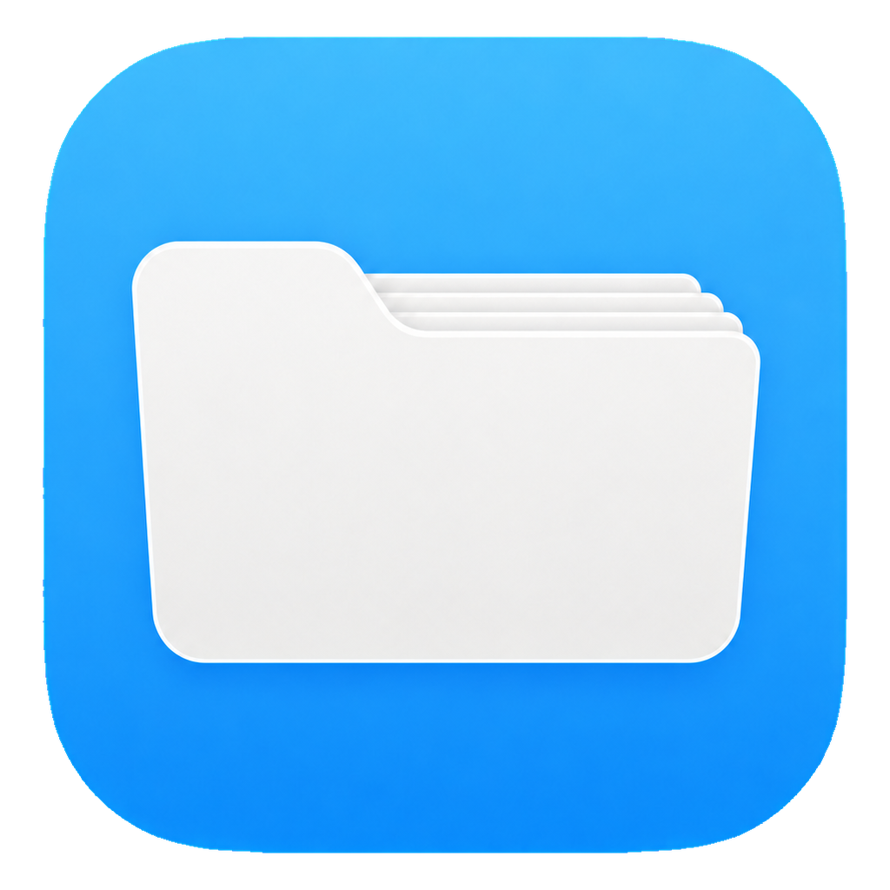

# Coding Agent Account Switcher

  

[English](README.md) · [Español](README.es.md) · [Français](README.fr.md) · [Deutsch](README.de.md) · [日本語](README.ja.md) · [한국어](README.ko.md) · [Português (Brasil)](README.pt-BR.md) · [Русский](README.ru.md) · [العربية](README.ar.md) · [हिन्दी](README.hi.md)

Простое приложение для Windows, которое переключает сохранённые учётные записи
или настройки API-сервисов для Codex, Claude Code и OpenCode.

Оно меняет только данные учётной записи и поддерживаемые настройки API,
сохранённые в профиле. Серверы MCP, навыки, плагины, настройки проектов и
история остаются на своих местах.

> [!IMPORTANT]
> Это неофициальный проект сообщества. Он не связан с OpenAI, Anthropic, Apple
> или проектом OpenCode. Он не переносит подписки, не обходит требования входа и
> не отменяет правила организации.

## Скачать

Текущая версия доступна в
[последнем выпуске](https://github.com/zzz1999/coding-agent-account-switcher/releases/latest):

- **Установщик:** <code>CAAS-vX.Y.Z-Setup-x64.exe</code>
- **Портативное приложение:** <code>CAAS-vX.Y.Z-Portable-x64.exe</code>
- **Контрольные суммы:** для каждого файла есть соответствующий SHA-256

Установка выполняется только для текущего пользователя, не требует прав
администратора и не включает **Запускать вместе с Windows** без вашего выбора.
Текущие сборки не подписаны, поэтому Windows SmartScreen может показать предупреждение.

## Основные возможности

- Сохраняйте личные, рабочие и API-профили с понятными именами.
- Переключайте учётные записи Codex, Claude Code и OpenCode в несколько нажатий.
- Храните поддерживаемые адреса, ключи и маршрутизацию поставщика API в нужном профиле.
- Переименовывайте профиль двойным щелчком или удаляйте локальный снимок.
- Получайте ясное подтверждение активного профиля после переключения.
- Блокируйте переключение, пока связанные приложения открыты.
- Используйте один из 10 встроенных языков.
- Сохраняйте светлую/тёмную тему и язык между запусками.
- При повторном запуске в том же сеансе Windows приложение восстанавливает и
  выводит вперёд существующее окно, а не создаёт ещё одно.
- При желании запускайте с Windows и проверяйте обновления вручную.

Все данные остаются на компьютере. В приложении нет аналитики и телеметрии.

## Поддерживаемые приложения

| Приложение | Что переключается | Что остаётся неизменным |
| --- | --- | --- |
| Codex | Вход и подключение выбранного поставщика API | Модели, параметры проверки/рассуждения, функции, MCP, навыки, сеансы, история и другие настройки |
| Claude Code | Вход и поддерживаемые настройки адреса/ключа API | Плагины, MCP, проекты, история и другие настройки |
| OpenCode | Сохранённый вход и поддерживаемые настройки поставщика/модели | Конфигурация проекта и другие настройки |

Меняются только поддерживаемые проектом поля учётной записи. Точный список
приведён в документе [Архитектура](docs/ARCHITECTURE.md).

## Быстрый старт

1. Войдите обычным способом или настройте нужный API-сервис.
2. Откройте приложение и выберите соответствующего поставщика.
3. Нажмите **Сохранить текущую учётную запись** и задайте имя, например <code>Personal</code>.
4. Войдите во вторую учётную запись или настройте другой API-сервис.
5. Сохраните профиль, например как <code>Work</code>.
6. Перед переключением полностью закройте соответствующее приложение, затем выберите сохранённый профиль.

Учётную запись можно сохранить, пока соответствующее приложение открыто. Перед
переключением приложение проверяет запущенные процессы. Если что-то открыто, оно
попросит закрыть программу и ничего не изменит.

Если текущая учётная запись изменилась после сохранения, приложение попросит
подтверждение. Если это действительно другая учётная запись, сначала сохраните
её как новый профиль.

## Профили и настройки

- **Переименовать:** дважды щёлкните имя профиля.
- **Удалить:** используйте кнопку корзины. Удаляется только локальный
  зашифрованный снимок; учётная запись не удаляется и выход не выполняется.
- **Последний выбранный:** профиль, который приложение активировало последним.
- **Повреждённый снимок:** отсутствующий или нечитаемый снимок скрывается, а
  исправные профили остаются доступными.
- **Тема и язык:** сохраняются для текущего пользователя Windows.
- **Запускать вместе с Windows:** необязательно, только для текущего пользователя.
- **Проверить обновления:** запускается только после нажатия, без автоматической загрузки и установки.

## Конфиденциальность и безопасность

- Профили шифруются Windows DPAPI для текущего пользователя.
- Учётные данные и ключи API не отображаются и не записываются в журналы.
- Профили хранятся в <code>%LOCALAPPDATA%\CodingAgentAccountSwitcher</code>.
- Защищённая замена файлов и восстановление снижают риск неполных изменений.
- Приложение не отправляет учётные данные, имена профилей, идентификаторы устройства или телеметрию.
- На рабочие учётные записи могут распространяться правила организации;
  получите разрешение перед сохранением дополнительной локальной копии входа.

Перед сообщением о проблеме безопасности прочитайте [SECURITY.md](SECURITY.md).

## Ограничения

- Выход на стороне поставщика, истечение токена, SSO, MFA или правила организации
  всё ещё могут потребовать обычного входа.
- Существующие разговоры Codex остаются привязаны к поставщику, с которым они
  были созданы. После смены поставщика начните новый разговор либо вернитесь к
  исходному поставщику, чтобы продолжить прежний.
- Приложение не переносит подписки и не гарантирует постоянный вход.
- Сейчас поддерживаются только Windows 10 и Windows 11 x64.

## Сборка из исходного кода

Требуются Windows и .NET SDK 8.0.400 или более новая feature band .NET 8.

~~~powershell
dotnet restore CodingAgentAccountSwitcher.sln
dotnet test CodingAgentAccountSwitcher.sln --configuration Release
dotnet run --project .\src\CodingAgentAccountSwitcher.App\CodingAgentAccountSwitcher.App.csproj
~~~

Каждый push в <code>main</code> публикует новый версионный выпуск через GitHub
Actions. Установщик и портативное приложение остаются только в последнем выпуске.

## Участие в разработке

Вклад приветствуется. Прочитайте [CONTRIBUTING.md](CONTRIBUTING.md).
Никогда не добавляйте настоящие учётные данные или ключи API в Issues, журналы,
тесты или коммиты.

## Уведомления о стороннем ПО

Приложение использует [Tomlyn](https://github.com/xoofx/Tomlyn) по лицензии
BSD 2-Clause. Полный текст уведомления об авторских правах и лицензии приведён
в [английском README](README.md#third-party-notices).

Установщик также включает переводы [Inno Setup](https://jrsoftware.org/),
распространяемые по [лицензии Inno Setup](installer/Languages/LICENSE.txt).

## Лицензия

[MIT](LICENSE)
